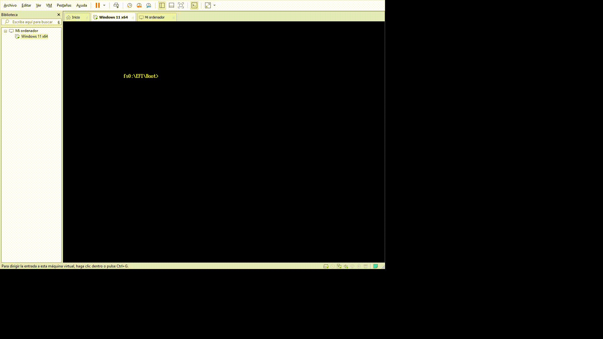

# 🛡️ Forensic UEFI Boot Tool

Herramienta forense modular desarrollada como aplicación UEFI nativa con [EDK II](https://github.com/tianocore/edk2). Se ejecuta **antes de que el sistema operativo cargue**, inspeccionando el entorno de firmware en su estado más primitivo sin depender de ningún SO.

> Desarrollada como Trabajo de Fin de Máster — Máster en Ciberseguridad: Análisis de malware y reversing  
> Campus Internacional de Ciberseguridad · 2025–2026

---

## ¿Para qué sirve?

La herramienta permite a un analista forense inspeccionar desde el propio entorno UEFI:

| Módulo | Qué hace |
|---|---|
| **Menu\_kit** | Menú principal. Carga los demás módulos dinámicamente. |
| **Files\_shows** | Lista dispositivos de almacenamiento y archivos `.efi` con hash SHA-256. Permite cargar cualquier EFI encontrado. |
| **Show\_info** | Inspecciona variables NVRAM, estado de Secure Boot, mapa de memoria, variables de arranque y hardware. |
| **Forensic\_Tool** | Genera reportes forenses con timestamp, compara contra whitelist, analiza GPT, lee PCRs del TPM2. |

**Principio de diseño fundamental:** la herramienta nunca escribe en el disco analizado. Todos los logs se guardan en el propio USB de arranque.

---

## Estructura del repositorio

```
Forensic-UEFI-Tool/
│
├── ForensicPkg/                    # Paquete EDK II — todo el código fuente
│   ├── Menu_kit/
│   │   ├── Menu_kit.c              # Punto de entrada y orquestador
│   │   ├── Menu_kit.h
│   │   └── Menu_kit.inf            # Descriptor EDK II (BASE_NAME: Menu_kit_TFM)
│   │
│   ├── Files_shows/
│   │   ├── Files_shows.c           # Escaneo recursivo + SHA-256 + paginación
│   │   ├── Files_shows.h
│   │   └── Files_shows.inf
│   │
│   ├── Show_info/
│   │   ├── Show_info.c             # NVRAM, Secure Boot, memoria, hardware
│   │   ├── Show_info.h
│   │   └── Show_info.inf
│   │
│   ├── Forense_tool/
│   │   ├── Forense_tool.c          # Reporte forense, whitelist, GPT, TPM2
│   │   ├── Forense_tool.h
│   │   └── Forense_tool.inf
│   │
│   ├── ForensicPkg.dec             # Declaración del paquete EDK II
│   └── ForensicPkg.dsc             # Descripción de compilación del paquete
│
├── tools/
│   └── whitelist.txt               # Hashes SHA-256 conocidos (uno por línea, 64 chars)
│
├── compile_forensic.bat            # Script de compilación (Windows)
├── README.md
└── LICENSE
```

> **Importante:** la carpeta `ForensicPkg/` debe colocarse dentro del workspace de EDK II (`C:\edk2\ForensicPkg\`) para que el sistema de compilación pueda resolverla.

### Estructura en el USB/ESP tras la compilación

```
USB (FAT32)
└── EFI/
    └── Boot/
        ├── BOOTX64.EFI         ← Menu_kit_TFM.efi (renombrado)
        └── tools/
            ├── Files_shows.efi
            ├── Show_info.efi
            ├── Forensic_tool.efi
            └── whitelist.txt
```

---

## Requisitos

### Sistema operativo de desarrollo

- Windows 10/11 (recomendado)
- Linux o macOS (también soportado por EDK II)

### Herramientas obligatorias

| Herramienta | Versión mínima | Descarga |
|---|---|---|
| **EDK II** | Última estable | [github.com/tianocore/edk2](https://github.com/tianocore/edk2) |
| **Visual Studio** | VS2019 / VS2022 | [visualstudio.microsoft.com](https://visualstudio.microsoft.com/es/vs/older-downloads/) |
| **Python** | 3.7 o superior | [python.org](https://www.python.org/downloads/) |
| **NASM** | Última estable | [nasm.us](https://www.nasm.us/pub/nasm/releasebuilds/) |
| **ASL Compiler (iasl)** | Última estable | [acpica.org](https://acpica.org/downloads) |

> **Nota:** Se recomienda instalar NASM en `C:\nasm\` y añadirlo al PATH del sistema. Lo mismo con iasl.

### Para pruebas en emulador (opcional pero recomendado)

| Herramienta | Descarga |
|---|---|
| **QEMU** | [qemu.org](https://www.qemu.org/download/) |
| **OVMF** (firmware UEFI para QEMU) | Incluido en los paquetes `ovmf` de la mayoría de distros Linux |

---

## Instalación y compilación

### 1. Clonar EDK II

```bat
git clone https://github.com/tianocore/edk2.git
cd edk2
git submodule update --init
```

### 2. Clonar este repositorio dentro del workspace de EDK II

```bat
git clone https://github.com/tu-usuario/Forensic-UEFI-Tool.git
```

Copia la carpeta `ForensicPkg\` dentro de `C:\edk2\`:

```
C:\edk2\ForensicPkg\   ← aquí debe quedar el paquete
```

Copia también `compile_forensic.bat` y la carpeta `tools\` a la raíz de `C:\edk2\`.

### 2. Inicializar el entorno EDK II

```bat
cd C:\edk2
edksetup.bat
```

Si es la primera vez o hay errores en las BaseTools:

```bat
edksetup.bat Rebuild
```

### 3. Compilar con el script incluido

Desde la raíz del workspace de EDK II (`C:\edk2`):

```bat
compile_forensic.bat
```

El script compila los cuatro módulos y organiza los binarios en la carpeta `output_efi\`. Los `.efi` también estarán disponibles en:

```
Build\ForensicPkg\DEBUG_VS2019\X64\
```

### 4. Preparar el USB de arranque

Formatea un USB en FAT32 y copia los binarios con la siguiente estructura:

```
EFI\Boot\BOOTX64.EFI          ← Menu_kit_TFM.efi
EFI\Boot\tools\Files_shows.efi
EFI\Boot\tools\Show_info.efi
EFI\Boot\tools\Forensic_tool.efi
EFI\Boot\tools\whitelist.txt
```

Para arrancar desde el USB, selecciónalo en el menú de arranque de la UEFI (normalmente F11 o F12 durante el POST).

---

## Whitelist

El archivo `tools/whitelist.txt` contiene los hashes SHA-256 de los binarios EFI considerados legítimos en el sistema analizado. El módulo **Forensic\_Tool** lo utiliza para identificar archivos desconocidos o modificados.

### Formato

Un hash SHA-256 en hexadecimal por línea (exactamente **64 caracteres**). Las líneas vacías o con longitud distinta se ignoran automáticamente.

```
2d26b3bca41665dab8a48fb387d1954b9a3c7e8f4d5b6c1a2e3f4a5b6c7d8e9f
a1b2c3d4e5f6a7b8c9d0e1f2a3b4c5d6e7f8a9b0c1d2e3f4a5b6c7d8e9f0a1
```

Para generar hashes de los EFIs legítimos de un sistema limpio:

```powershell
# PowerShell
Get-FileHash -Algorithm SHA256 .\archivo.efi | Select-Object -ExpandProperty Hash
```

```bash
# Linux / macOS
sha256sum archivo.efi | awk '{print $1}'
```

---

## Prueba en QEMU (sin hardware real)

```bat
qemu-system-x86_64 ^
  -bios C:\path\to\OVMF.fd ^
  -drive format=raw,file=disk.img ^
  -m 256M ^
  -nographic
```

Para crear la imagen de disco FAT32 con los binarios en Linux:

```bash
dd if=/dev/zero of=disk.img bs=1M count=256
mkfs.fat -F 32 disk.img
mmd -i disk.img ::EFI ::EFI/Boot ::EFI/Boot/tools
mcopy -i disk.img Menu_kit_TFM.efi ::EFI/Boot/BOOTX64.EFI
mcopy -i disk.img Files_shows.efi ::EFI/Boot/tools/
mcopy -i disk.img Show_info.efi ::EFI/Boot/tools/
mcopy -i disk.img Forensic_tool.efi ::EFI/Boot/tools/
mcopy -i disk.img whitelist.txt ::EFI/Boot/tools/
```
---

## Prueba de funcionamiento



---

## Referencias útiles

- [UEFI Specification 2.10](https://uefi.org/specifications)
- [EDK II Documentation](https://github.com/tianocore/tianocore.github.io/wiki/EDK-II-Documents)
- [Getting Started with EDK II](https://www.tianocore.org/tianocore-wiki.github.io/development/tutorials-howto/getting_started_with_edk_ii.html)
- [PI Boot Flow (SEC, PEI, DXE, BDS)](https://github.com/tianocore/tianocore.github.io/wiki/PI-Boot-Flow)
- [OSDev Wiki — UEFI](https://wiki.osdev.org/UEFI)

---
